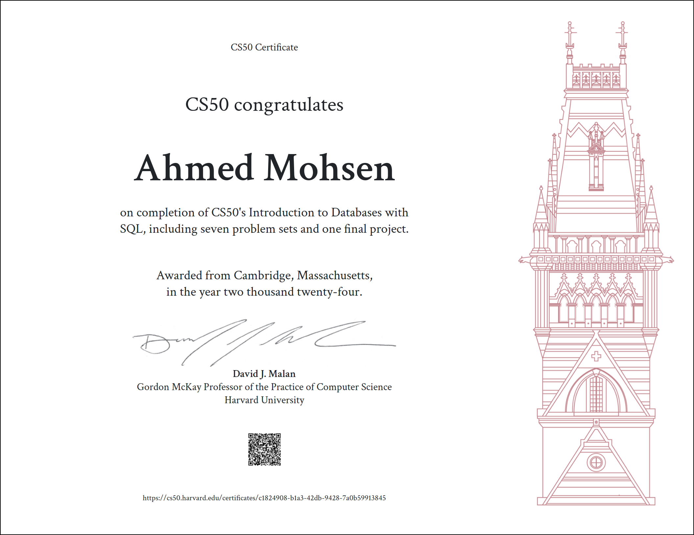

# CS50 Introduction to SQL

This repository contains my solutions and notes from the CS50 Introduction to SQL course. The course covers fundamental SQL concepts including data manipulation, querying, and database design.

## Contents

- **Assignments:** SQL queries and solutions for course exercises.
- **Projects:** Practical projects demonstrating the application of SQL concepts.
- **Notes:** Personal notes and summaries of key concepts from the course.

## Course Overview

CS50's Introduction to SQL course teaches the essentials of SQL, the standard language for relational database management. Topics covered include:

- Writing basic to advanced SQL queries
- Creating and modifying database schemas
- Working with aggregate functions, subqueries, and joins
- Designing relational databases with real-world applications
- 
## Course Structure

- **7 Problem Sets**: These assignments cover various SQL concepts such as data manipulation, joins, aggregation, and more.
- **Final Project**: A comprehensive project applying the skills learned throughout the course, and here you can check my (final project)[https://github.com/27medMo7sen/Harvard-CS50-SQL-Course/tree/main/project]
- where you find a design file which explain every thing about the project.

## Certificate

## Usage

Feel free to explore the code, use it as a reference, or adapt it for your own learning purposes. 

## License

This repository is licensed under the MIT License.
