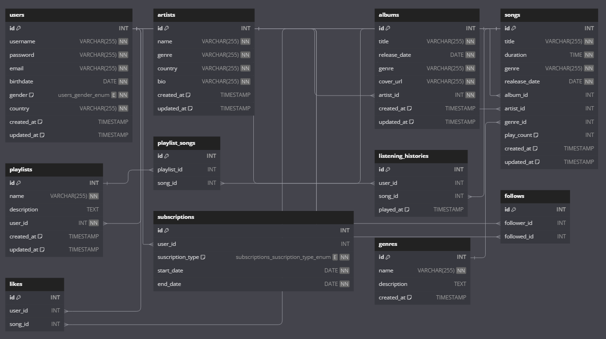

# Music Streaming Database Design

- By: Ahmed Mohsen

- Video link: https://drive.google.com/file/d/1iAYg5YVHZI23hwPXcN0ASHO02CVjwtrW/view?usp=sharing
## Scope

The database for the music streaming application includes all the entities necessary to facilitate the process of storing and managing user data, artist information, albums, songs, and playlists. It also tracks user interactions such as likes, listening history, and follows. The database supports:

- Users and their subscriptions.
- Artists and their albums.
- Songs and their genres.
- Playlists created by users.
- Relationships between users and their liked songs, followed users, and listening history.

Out of scope are elements like in-depth analytics, advertisements, and recommendations based on user behavior.

## Functional Requirements

This database will support:

- CRUD operations for users, artists, albums, songs, and playlists.
- Tracking user listening history and liked songs.
- Managing user subscriptions and interactions such as following other users.
- Managing relationships between songs, albums, artists, and genres.

## Representation

Entities are captured in MySQL tables with the following schema.

### Entities

The database includes the following entities:

#### Users

The `users` table includes:

- `id`: An `INT` that specifies the unique ID for the user. This column is the `PRIMARY KEY`.
- `username`: A `VARCHAR(255)` that stores the username. A `UNIQUE` constraint ensures no two users have the same username.
- `password`: A `VARCHAR(255)` that stores the user's password.
- `email`: A `VARCHAR(255)` that stores the user's email address.
- `birthdate`: A `DATE` that stores the user's birthdate.
- `gender`: An `ENUM('M', 'F', 'O')` that stores the user's gender.
- `country`: A `VARCHAR(255)` that stores the user's country.
- `created_at`: A `TIMESTAMP` that records when the user was created, with a default value of the current timestamp.
- `updated_at`: A `TIMESTAMP` that records when the user was last updated, automatically updated on each change.

#### Artists

The `artists` table includes:

- `id`: An `INT` that specifies the unique ID for the artist. This column is the `PRIMARY KEY`.
- `name`: A `VARCHAR(255)` that stores the artist's name. A `UNIQUE` constraint ensures no two artists have the same name.
- `genre`: A `VARCHAR(255)` that stores the artist's genre.
- `country`: A `VARCHAR(255)` that stores the artist's country.
- `bio`: A `VARCHAR(255)` that stores the artist's biography.
- `created_at`: A `TIMESTAMP` that records when the artist was created, with a default value of the current timestamp.
- `updated_at`: A `TIMESTAMP` that records when the artist was last updated, automatically updated on each change.

#### Albums

The `albums` table includes:

- `id`: An `INT` that specifies the unique ID for the album. This column is the `PRIMARY KEY`.
- `title`: A `VARCHAR(255)` that stores the album's title.
- `release_date`: A `DATE` that stores the album's release date.
- `genre`: A `VARCHAR(255)` that stores the album's genre.
- `cover_url`: A `VARCHAR(255)` that stores the URL to the album cover image.
- `artist_id`: An `INT` that stores the ID of the artist who created the album. This column is a `FOREIGN KEY` that references the `id` column in the `artists` table.
- `created_at`: A `TIMESTAMP` that records when the album was created, with a default value of the current timestamp.
- `updated_at`: A `TIMESTAMP` that records when the album was last updated, automatically updated on each change.

#### Songs

The `songs` table includes:

- `id`: An `INT` that specifies the unique ID for the song. This column is the `PRIMARY KEY`.
- `title`: A `VARCHAR(255)` that stores the song's title.
- `duration`: A `TIME` that stores the duration of the song.
- `genre`: A `VARCHAR(255)` that stores the song's genre.
- `release_date`: A `DATE` that stores the song's release date.
- `album_id`: An `INT` that stores the ID of the album the song belongs to. This column is a `FOREIGN KEY` that references the `id` column in the `albums` table.
- `artist_id`: An `INT` that stores the ID of the artist who created the song. This column is a `FOREIGN KEY` that references the `id` column in the `artists` table.
- `genre_id`: An `INT` that stores the ID of the genre the song belongs to. This column is a `FOREIGN KEY` that references the `id` column in the `genres` table.
- `play_count`: An `INT` that stores the number of times the song has been played, with a default value of `0`.
- `created_at`: A `TIMESTAMP` that records when the song was created, with a default value of the current timestamp.
- `updated_at`: A `TIMESTAMP` that records when the song was last updated, automatically updated on each change.

#### Playlists

The `playlists` table includes:

- `id`: An `INT` that specifies the unique ID for the playlist. This column is the `PRIMARY KEY`.
- `name`: A `VARCHAR(255)` that stores the playlist's name.
- `description`: A `TEXT` that stores the playlist's description.
- `user_id`: An `INT` that stores the ID of the user who created the playlist. This column is a `FOREIGN KEY` that references the `id` column in the `users` table.
- `created_at`: A `TIMESTAMP` that records when the playlist was created, with a default value of the current timestamp.
- `updated_at`: A `TIMESTAMP` that records when the playlist was last updated, automatically updated on each change.

#### Playlist Songs

The `playlist_songs` table includes:

- `id`: An `INT` that specifies the unique ID for the playlist song entry. This column is the `PRIMARY KEY`.
- `playlist_id`: An `INT` that stores the ID of the playlist. This column is a `FOREIGN KEY` that references the `id` column in the `playlists` table.
- `song_id`: An `INT` that stores the ID of the song. This column is a `FOREIGN KEY` that references the `id` column in the `songs` table.

#### Listening Histories

The `listening_histories` table includes:

- `id`: An `INT` that specifies the unique ID for the listening history entry. This column is the `PRIMARY KEY`.
- `user_id`: An `INT` that stores the ID of the user. This column is a `FOREIGN KEY` that references the `id` column in the `users` table.
- `song_id`: An `INT` that stores the ID of the song. This column is a `FOREIGN KEY` that references the `id` column in the `songs` table.
- `played_at`: A `TIMESTAMP` that records when the song was played, with a default value of the current timestamp.

#### Follows

The `follows` table includes:

- `id`: An `INT` that specifies the unique ID for the follow relationship. This column is the `PRIMARY KEY`.
- `follower_id`: An `INT` that stores the ID of the user who is following. This column is a `FOREIGN KEY` that references the `id` column in the `users` table.
- `followed_id`: An `INT` that stores the ID of the user who is being followed. This column is a `FOREIGN KEY` that references the `id` column in the `users` table.

#### Likes

The `likes` table includes:

- `id`: An `INT` that specifies the unique ID for the like entry. This column is the `PRIMARY KEY`.
- `user_id`: An `INT` that stores the ID of the user who liked the song. This column is a `FOREIGN KEY` that references the `id` column in the `users` table.
- `song_id`: An `INT` that stores the ID of the liked song. This column is a `FOREIGN KEY` that references the `id` column in the `songs` table.

#### Subscriptions

The `subscriptions` table includes:

- `id`: An `INT` that specifies the unique ID for the subscription entry. This column is the `PRIMARY KEY`.
- `user_id`: An `INT` that stores the ID of the user who subscribed. This column is a `FOREIGN KEY` that references the `id` column in the `users` table.
- `subscription_type`: An `ENUM('FREE', 'PREMIUM', 'PREMIUM_PLUS')` that stores the type of subscription.
- `start_date`: A `DATE` that stores the start date of the subscription.
- `end_date`: A `DATE` that stores the end date of the subscription.

#### Genres

The `genres` table includes:

- `id`: An `INT` that specifies the unique ID for the genre. This column is the `PRIMARY KEY`.
- `name`: A `VARCHAR(255)` that stores the name of the genre. A `UNIQUE` constraint ensures no two genres have the same name.
- `description`: A `TEXT` that stores a description of the genre.
- `created_at`: A `TIMESTAMP` that records when the genre was created, with a default value of the current timestamp.

### Relationships
The below entity relationship diagram describes the relationships among the entities in the database.

- **One-to-Many**:
  - A user can have many playlists.
  - An artist can have many albums and songs.
  - An album can have many songs.
  - A playlist can have many songs.
- **Many-to-Many**:
  - Users can follow multiple users and be followed by multiple users.
  - Songs can belong to multiple playlists.
- **One-to-One**:
  - Each subscription is linked to a single user.

## Optimizations

In this section, we discuss the various optimizations implemented to enhance the database performance.

* **Indexes**:
  - **Albums Table**: An index on the `artist_id` column to improve query performance when retrieving albums by a specific artist.
  - **Follows Table**: Two indexes on the `followed_id` and `follower_id` columns to speed up queries related to user relationships.
  - **Likes Table**: An index on the `song_id` column to optimize the performance of queries that count or retrieve likes for specific songs.
  - **Listening Histories Table**: Multiple indexes on `song_id`, `user_id`, and a combined index on `user_id` and `song_id` to enhance the speed of retrieving user listening histories.
  - **Playlist Songs Table**: Indexes on the `playlist_id` and `song_id` columns to improve the efficiency of managing songs within playlists.
  - **Playlists Table**: An index on the `user_id` column to speed up retrieval of playlists created by a specific user.
  - **Songs Table**: Indexes on `genre_id`, `album_id`, and `artist_id` columns to improve performance when filtering or searching for songs by genre, album, or artist.
  - **Subscriptions Table**: An index on the `user_id` column to enhance query performance related to user subscriptions.

* **Views**:
  - **Top Liked Songs View**: This view selects the top liked songs, listing their title, genre, number of plays, and number of likes. It aggregates data across the `songs`, `likes`, and `genres` tables and orders by the number of likes in descending order.
  - **Top Songs View**: This view provides details on the top played songs, including their title, duration, number of plays, and number of likes. It aggregates data from the `songs`, `genres`, and `likes` tables, ordering by play count.
  - **Top Artists View**: This view highlights the top artists based on the number of followers and likes. It aggregates data across `artists`, `albums`, `songs`, `likes`, and `follows` tables, ordered by the number of followers.
  - **Top Genres View**: This view lists the most popular genres based on the number of likes. It aggregates data from `genres`, `songs`, and `likes` tables, ordered by the number of likes.

These optimizations were implemented to improve the speed and efficiency of frequently run queries, ensuring a better user experience by reducing latency and enhancing the responsiveness of the system.

## Limitations

In this section, we identify the limitations of the current database design.

* **Scalability**:
  - The current design may face challenges when scaling to handle extremely large datasets, such as millions of songs, artists, or users, particularly in maintaining performance across complex queries.

* **Complex Query Performance**:
  - While the views and indexes improve query performance, certain complex queries involving multiple joins across large tables could still be slow, potentially requiring further optimization or database restructuring.

* **Real-Time Analytics**:
  - The design may not be optimal for real-time analytics, such as instantly updating play counts or likes as user interactions occur. This might require more sophisticated techniques like caching or using a separate system for real-time data processing.

These limitations should be considered for future enhancements, especially as the database grows or user requirements evolve, to ensure continued performance and scalability.
